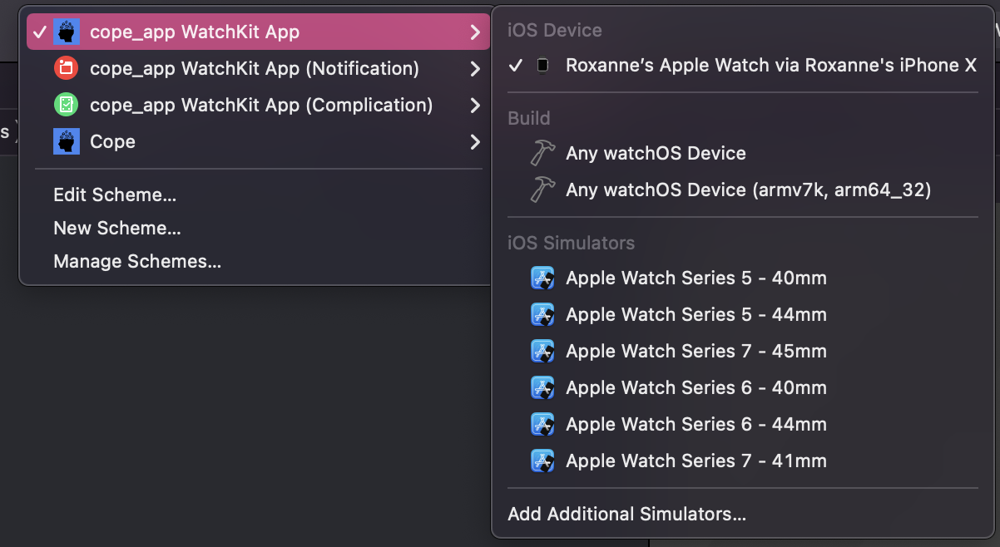

<h1 align="center">Cope App Installation Guide</h1>

---
1. Download the code ZIP file from Github
2. Open the project in XCode
3. Select your IOS device from the drop down menu  

4. Wait for the device to be ready for development
5. Press the play button to build and install on your device  

6. The app will boot up on your watch
7. Use Watch settings to add the complication to your watch face
