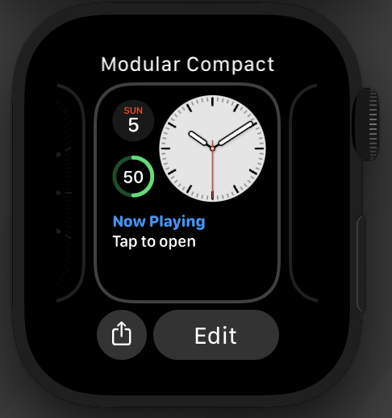
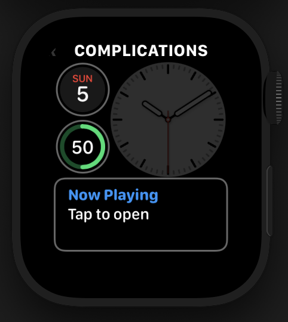
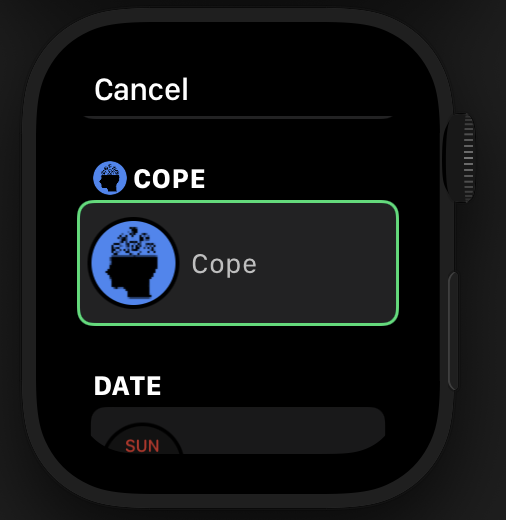
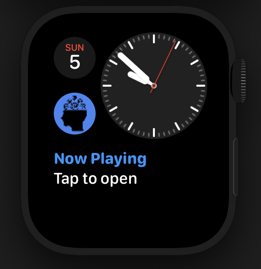
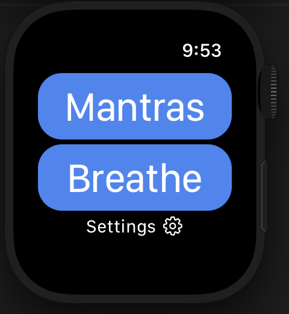
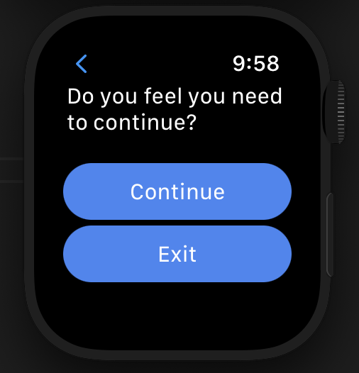
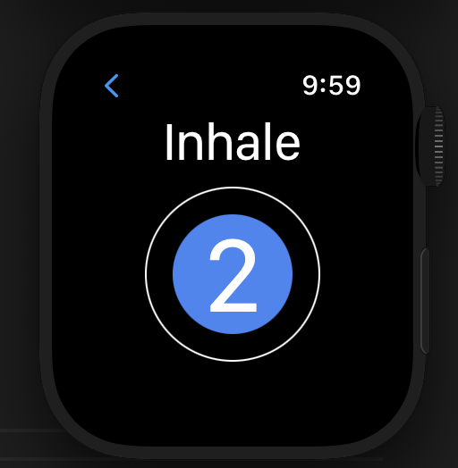
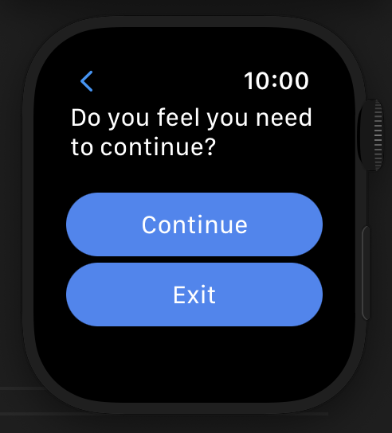
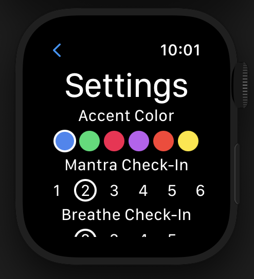

<h1 align="center">Cope App Instruction Manual</h1>

---
# Installation
1. Download the code ZIP file from Github
2. Open the project in XCode
3. Select your IOS device from the drop down menu  

4. Wait for the device to be ready for development
5. Press the play button to build and install on your device  

6. The app will boot up on your watch

# Complication
1. Hold down on the screen to edit the watch face  

2. Click edit and select the complication you wish to change  

3. Select the Cope App from the applications list  

4. Exit the settings and you will now have the complication on the watch face  
  
5. Launch the app any time using the complication

# Cope App
1. Choose between Breathe, Mantras, or Settings on the launch page  

## Mantras
1. Select the Mantras mini-app
2. Cycle through self-talk cues using the 'Next' button  

3. At check-in decide if you'd like to continue  

4. Exit any time using the watch crown (side button)
## Breathe
1. Select the Breathe mini-app
2. Cycle through breathing exercises  

3. At check-in decide if you'd like to continue  

4. Exit any time using the watch crown (side button)
## Settings
1. Select the Settings mini-app
2. Scroll through and change settings appropriately  

Accent Color: Changes display color of in-app buttons  
Mantra Check-In: Number of mantras displayed before check-in  
Breathe Check-In: Number of breaths displayed before check-in  
Breathe Length: Number of seconds for inhale and exhale cues  
Breathe Hold Length: Number of seconds for hold cue  
3. Exit any time using the watch crown (side button)  
*Settings save upon exiting the settings view*